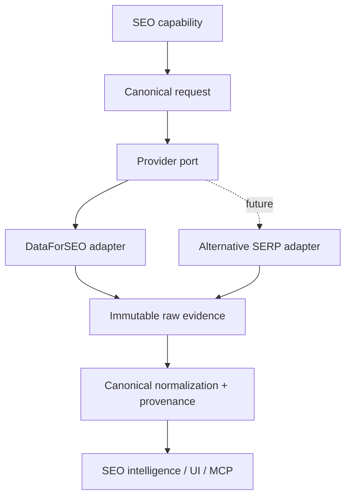

# Phase 1.5 provider decision

## Decision

**Use a hybrid architecture and wrap DataForSEO. Do not replace it wholesale now.** DataForSEO coupling is **EXTREME** at the product level, though operational calls are centralized. A direct replacement would require recreating unrelated commercial datasets and rewriting provider-shaped feature logic.

| Capability                    | Current                    | Recommended Future Source                                          | Decision                        | Reason                                                                                  |
| ----------------------------- | -------------------------- | ------------------------------------------------------------------ | ------------------------------- | --------------------------------------------------------------------------------------- |
| Basic Google SERP retrieval   | DataForSEO SERP            | DataForSEO adapter plus future self-hosted/commercial SERP adapter | HYBRID                          | Most plausible first replacement seam; requires equivalent locale/device/rank/features. |
| Native site crawling          | OpenSEO HTTP crawler       | Keep native crawler                                                | REPLACE WITH SELF-HOSTED SOURCE | Already application-owned; improve evidence capture, not provider replacement.          |
| Keyword volume/CPC/difficulty | DataForSEO Labs/Google Ads | Keep DataForSEO initially                                          | WRAP DATAFORSEO                 | Valuable dataset; no verified equivalent supplied.                                      |
| Domain/competitor dataset     | DataForSEO Labs            | Keep/wrap                                                          | WRAP DATAFORSEO                 | Depends on vendor corpus and semantics.                                                 |
| Backlinks                     | DataForSEO Backlinks       | Keep/wrap                                                          | WRAP DATAFORSEO                 | Large historical corpus is hard to self-host.                                           |
| Rank tracking                 | DataForSEO SERP            | Hybrid SERP port                                                   | HYBRID                          | Store canonical snapshots but support alternative acquisition.                          |
| Lighthouse                    | DataForSEO                 | Evaluate native Lighthouse later                                   | DEFER                           | Existing output works, but native execution feasibility needs separate validation.      |
| AI visibility                 | DataForSEO AI Optimization | Keep as optional adapter                                           | WRAP DATAFORSEO                 | Provider-specific coverage and geography; not evidence of direct engine access.         |
| SAM LLM                       | OpenRouter                 | Provider-neutral LLM port later                                    | WRAP DATAFORSEO does not apply  | Existing model-builder seam is relatively isolated.                                     |

## Direct answers

**A. Dependency:** extreme: DataForSEO underpins most core SEO capabilities.\
**B. Replace without rewrite:** no; a basic SERP adapter is possible, broad replacement is not.\
**C. Highest-value vendor capabilities:** keyword metrics, Labs/domain data, backlinks, localized SERP/rank data, and provider AI datasets.\
**D. Most replaceable:** basic SERP collection and existing native crawling; potentially Lighthouse after a separate feasibility test.\
**E. OpenSERP:** compatibility is unknown until a verified contract is available; it could only plausibly address basic SERPs.\
**F. Provider-neutral models:** weak.\
**G/H/I. Evidence/provenance/replay:** raw evidence partial, provenance weak, conclusions not generally replayable.\
**J/K. Costs/runaway paths:** DataForSEO rank tracking and Lighthouse crawl fan-out; SAM multi-step turns; AI multi-platform fan-out.\
**L. Smallest seam:** canonical SERP request/raw-evidence/normalized-observation port ahead of `dataforseo/serp.ts`.\
**M. Next architecture:** adapters → immutable evidence capture → canonical normalization/provenance → feature logic.\
**N. Overall:** BUILD HYBRID PROVIDER LAYER, beginning with an audit-only design of the SERP seam.

## Exact next step

Obtain one authorized low-spend DataForSEO credential and execute the three-request controlled live-validation boundary documented in `OPENSEO-PROVENANCE-AUDIT.md`; capture redacted immutable raw artifacts outside product tables. Review those artifacts and a verified alternative-SERP contract before writing any provider abstraction code.
