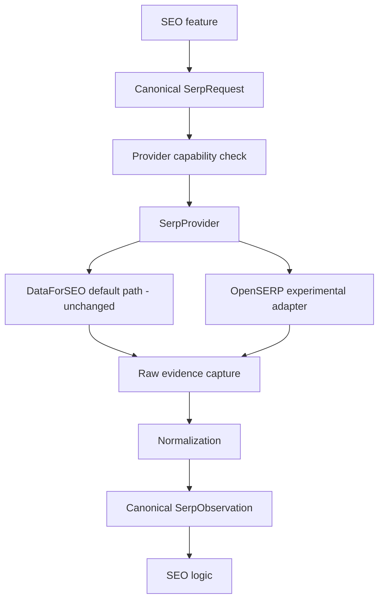

# SERP provider architecture

Phase 1.8 adds an isolated experimental boundary under `src/server/lib/serp-providers/`. Existing production acquisition remains `OpenSEO → DataForSEO`; no existing service imports the OpenSERP adapter.

The implemented OpenSERP adapter performs response-byte capture before JSON parsing, writes content-addressed append-only R2 evidence when given `createR2RawEvidenceStore`, and returns a canonical observation with separate organic/absolute rank plus evidence SHA-256/reference. It is not selected by any production route.
